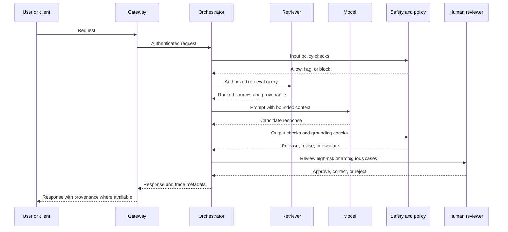

# Inference and RAG Flow

```mermaid
sequenceDiagram
    participant U as User or client
    participant G as Gateway
    participant O as Orchestrator
    participant R as Retriever
    participant M as Model
    participant S as Safety and policy
    participant H as Human reviewer

    U->>G: Request
    G->>O: Authenticated request
    O->>S: Input policy checks
    S-->>O: Allow, flag, or block
    O->>R: Authorized retrieval query
    R-->>O: Ranked sources and provenance
    O->>M: Prompt with bounded context
    M-->>O: Candidate response
    O->>S: Output checks and grounding checks
    S-->>O: Release, revise, or escalate
    O->>H: Review high-risk or ambiguous cases
    H-->>O: Approve, correct, or reject
    O-->>G: Response and trace metadata
    G-->>U: Response with provenance where available
```
