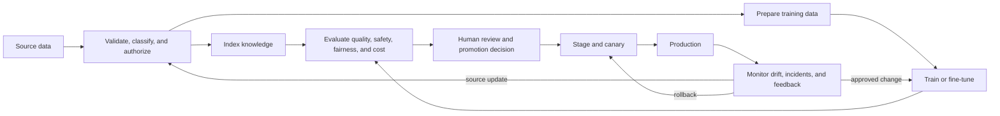

# Model and Knowledge Lifecycle

```mermaid
flowchart LR
    Data[Source data] --> Validate[Validate, classify, and authorize]
    Validate --> Index[Index knowledge]
    Validate --> Train[Prepare training data]
    Train --> Experiment[Train or fine-tune]
    Experiment --> Evaluate[Evaluate quality, safety, fairness, and cost]
    Index --> Evaluate
    Evaluate --> Review[Human review and promotion decision]
    Review --> Stage[Stage and canary]
    Stage --> Production[Production]
    Production --> Monitor[Monitor drift, incidents, and feedback]
    Monitor -->|approved change| Experiment
    Monitor -->|source update| Validate
    Monitor -->|rollback| Stage
```
