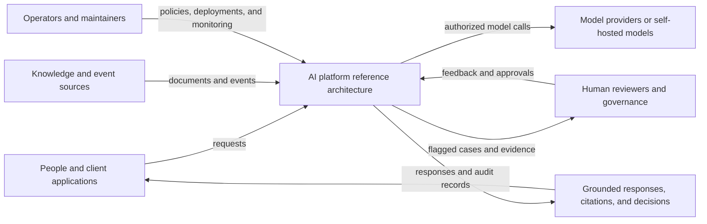

# System Context Diagram

```mermaid
flowchart LR
    User[People and client applications]
    Sources[Knowledge and event sources]
    Review[Human reviewers and governance]
    AI[AI platform reference architecture]
    Model[Model providers or self-hosted models]
    Ops[Operators and maintainers]
    Outputs[Grounded responses, citations, and decisions]

    User -->|requests| AI
    Sources -->|documents and events| AI
    AI -->|authorized model calls| Model
    AI -->|flagged cases and evidence| Review
    Review -->|feedback and approvals| AI
    Ops -->|policies, deployments, and monitoring| AI
    AI -->|responses and audit records| Outputs
    Outputs --> User
```

The platform mediates between users, knowledge sources, models, and human oversight. It should not be treated as an independent authority.
